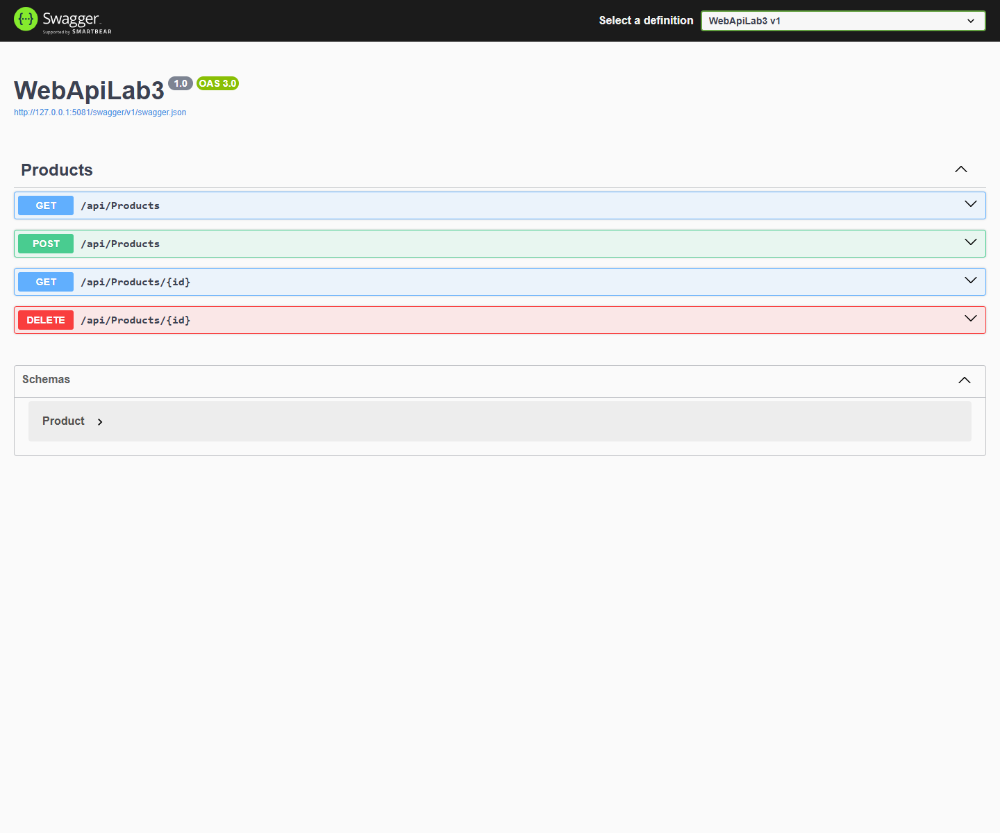
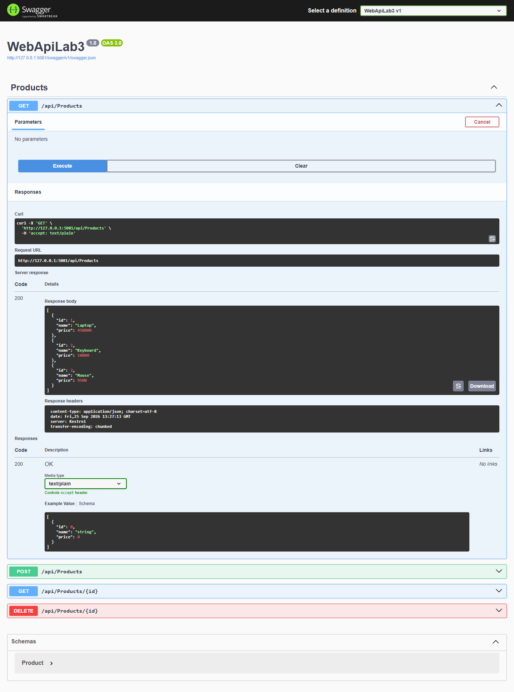
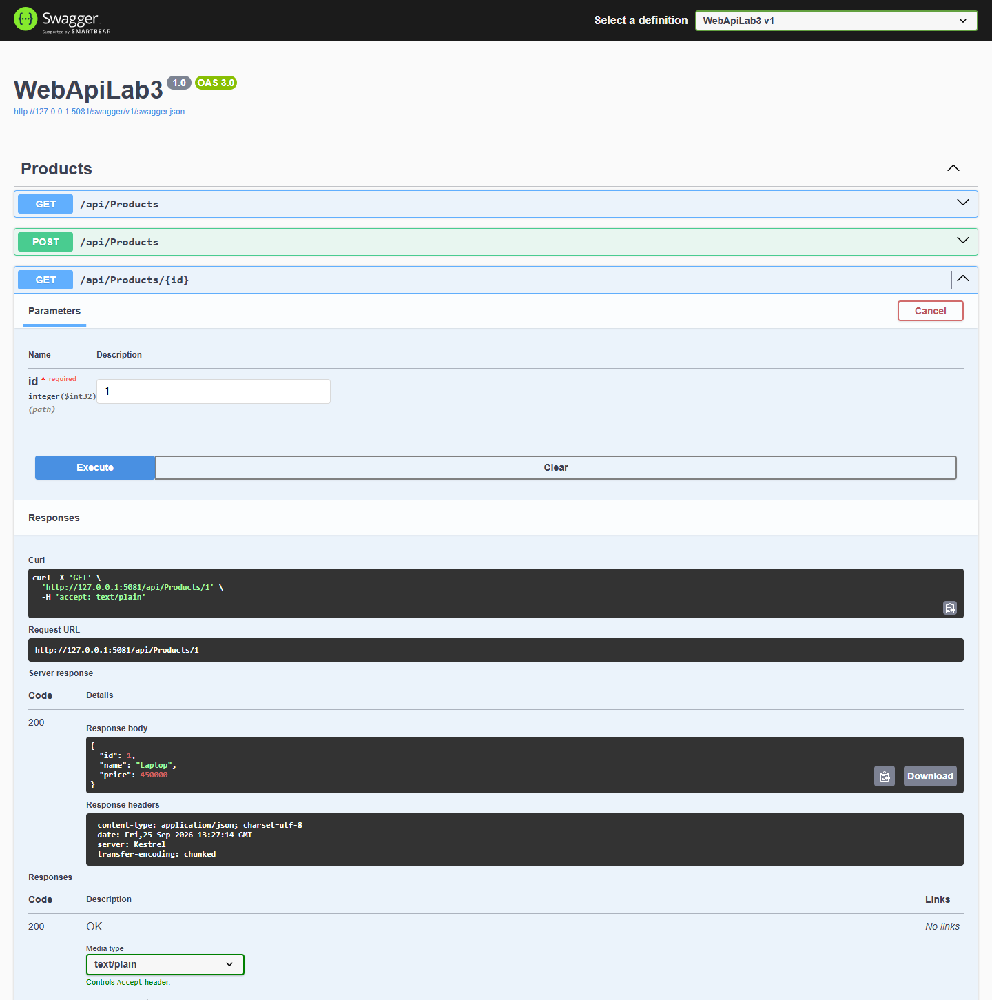
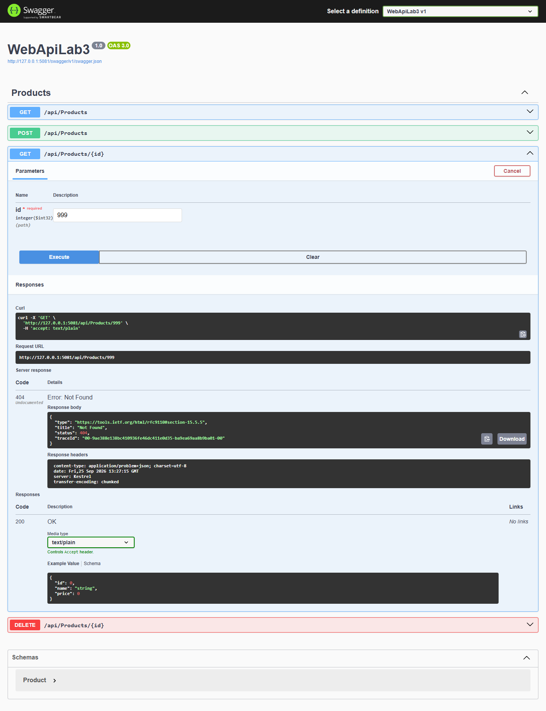
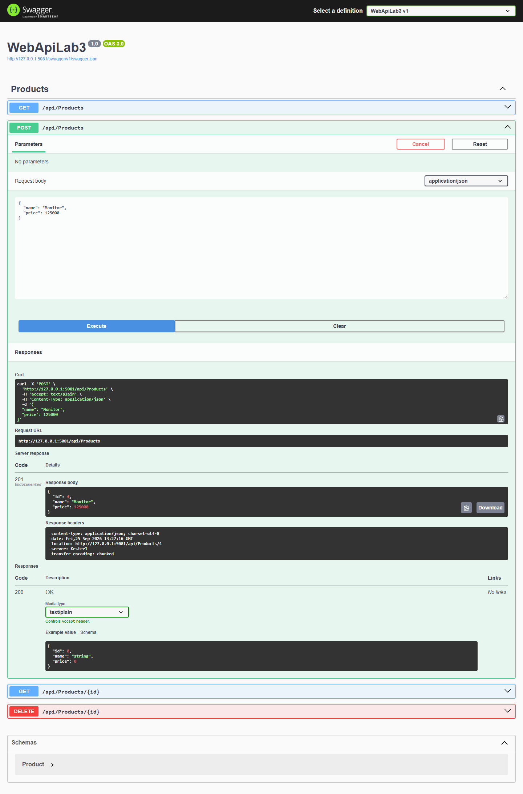
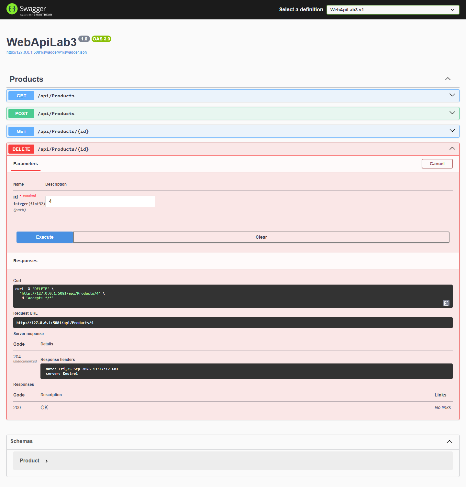
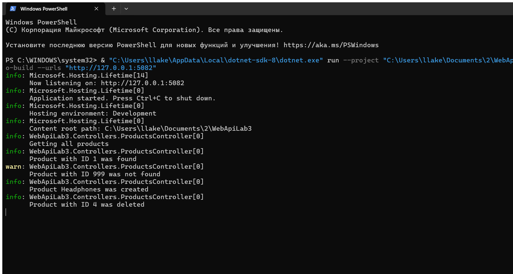

# WebApiLab3 — Модуль 03

## Цель работы

Закрепить применение Dependency Injection, интерфейсов, жизненных циклов зависимостей и `ILogger<T>` в ASP.NET Core Web API.

## Краткий отчёт

Создан проект ASP.NET Core Web API по стандартному шаблону с контроллерами. API управляет товарами в памяти через `List<Product>`. Сервис `ProductService` зарегистрирован как `Scoped` и передаётся в `ProductsController` через конструктор вместе с `ILogger<ProductsController>`.

## Модель Product

| Свойство | Тип | Назначение |
|---|---|---|
| `Id` | `int` | Идентификатор товара |
| `Name` | `string` | Наименование товара |
| `Price` | `decimal` | Цена товара |

## Выполненные шаги

| Шаг | Результат |
|---|---|
| Модель | Создан `Product` с `Id`, `Name`, `Price` |
| Сервис | Созданы `IProductService` и `ProductService`, добавлены 3 товара |
| DI | Использован `AddScoped<IProductService, ProductService>()` |
| Контроллер | Реализованы Constructor Injection и `ILogger<ProductsController>` |
| Логи | Настроены `ClearProviders`, `AddConsole`, `AddDebug` |
| Swagger | Выполнены GET, GET по Id, 404, POST, повторный GET и DELETE |

## Реализованные endpoint

| Метод | Endpoint | Результат |
|---|---|---|
| GET | `/api/products` | `200 OK`, список товаров |
| GET | `/api/products/{id}` | `200 OK`, `400 Bad Request` или `404 Not Found` |
| POST | `/api/products` | `201 Created` |
| DELETE | `/api/products/{id}` | `204 No Content` или `404 Not Found` |

## Пример JSON

```json
{
  "name": "Monitor",
  "price": 125000
}
```

## Swagger: реализованные API-методы



### GET /api/products — 200 OK

После **Try it out → Execute** получен список исходных товаров.



### GET /api/products/1 — 200 OK

После **Try it out → Execute** получен существующий товар.



### GET /api/products/999 — 404 Not Found

После **Try it out → Execute** API корректно вернул `404 Not Found`.



### POST /api/products — 201 Created

В Swagger создан товар `Monitor`.



### Повторный GET после POST

Проверено, что созданный товар появился в списке.


### DELETE /api/products/4 — 204 No Content

Созданный товар удалён.



## Логирование

В `Program.cs` включены провайдеры Console и Debug. В контроллере используются `LogInformation`, `LogWarning` и `LogError` в обработке исключения.

Отдельный реальный снимок PowerShell содержит журнал после GET, поиска существующего и отсутствующего товара, POST и DELETE.



В `appsettings.json` уровень `Default` установлен в `Information`. Если заменить его на `Warning`, сообщения `LogInformation` перестанут отображаться, потому что их уровень ниже установленного порога. Предупреждения и ошибки останутся видимыми.

## Жизненные циклы DI

| Жизненный цикл | Особенность | Пример |
|---|---|---|
| `Transient` | Новый экземпляр при каждом разрешении зависимости | Лёгкий сервис без состояния |
| `Scoped` | Один экземпляр на HTTP-запрос | Сервис с контекстом БД |
| `Singleton` | Один экземпляр на всё время работы приложения | Кэш или потокобезопасный общий сервис |

В работе выбран `Scoped`: сервис создаётся отдельно для каждого HTTP-запроса. `Singleton` требует особенно аккуратной работы с общим состоянием и потокобезопасностью.

## Ответы на контрольные вопросы

1. **Dependency Injection** — передача зависимостей объекту извне через DI-контейнер.
2. **Проблема, решаемая DI** — уменьшение жёсткой связи между классами и упрощение тестирования.
3. **Слабая связанность** — класс зависит от контракта, а не от конкретной реализации.
4. **Интерфейсы при DI** — позволяют заменить реализацию без изменения контроллера.
5. **Constructor Injection** — получение зависимостей через параметры конструктора.
6. **Регистрация в Program.cs** — сообщает DI-контейнеру, какую реализацию создать для интерфейса.
7. **ILogger<T>** — записывает диагностические сообщения с категорией класса.
8. **Information / Warning / Error** — штатное событие / необычная ситуация / ошибка выполнения.
9. **appsettings.json** — задаёт уровни и правила фильтрации логов.

## Вывод

DI отделяет `ProductsController` от конкретного `ProductService`, а логирование делает работу API наблюдаемой. На практике `Transient`, `Scoped` и `Singleton` выбираются по требуемому времени жизни объекта и наличию общего состояния.
